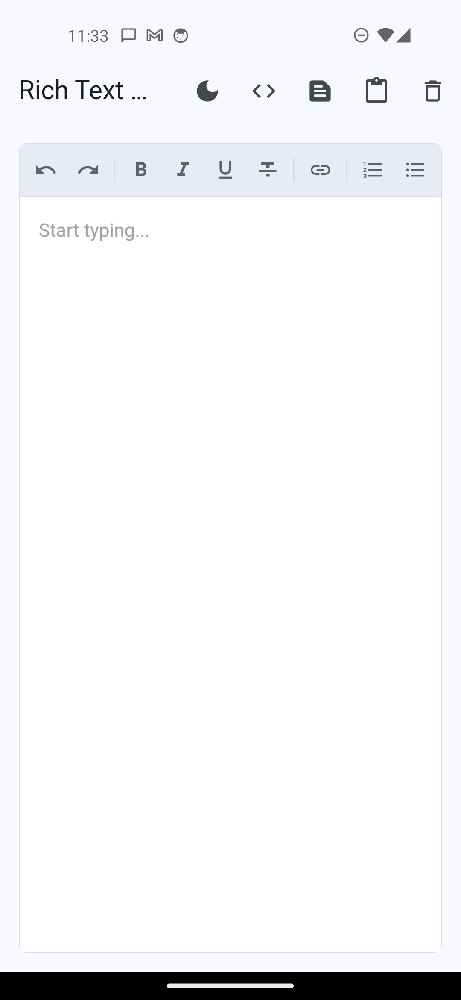
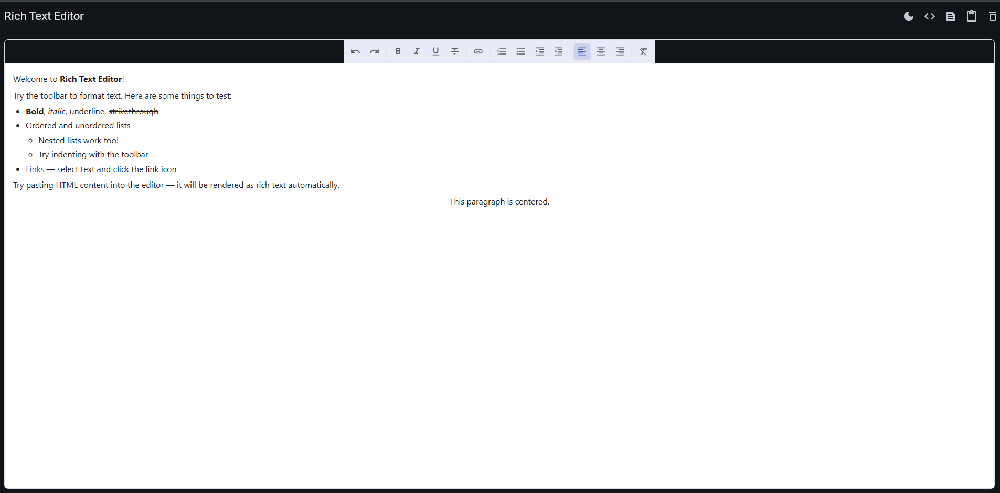

# rich_text_editor_plus

A rich text editor Flutter plugin with a native Flutter toolbar and browser-based editing. Works on **Android**, **iOS**, and **Web**.

## Screenshots

| Mobile | Web |
|--------|-----|
|  |  |

## Features

- **Text formatting** — Bold, Italic, Underline, Strikethrough
- **Lists** — Ordered and unordered, with nested indent/outdent support
- **Alignment** — Left, Center, Right, Justify
- **Links** — Insert, edit, and remove hyperlinks (Ctrl+K on web)
- **Undo / Redo** — Full history via browser `execCommand`
- **HTML import/export** — Set and get content as HTML; plain text also available
- **Keyboard shortcuts** — Ctrl+B, Ctrl+I, Ctrl+U, Ctrl+K on web
- **Customizable toolbar** — Show only the buttons you need, or replace the toolbar entirely
- **Theming** — Dark/light support via `RichEditorTheme`
- **Read-only mode** — Render HTML content without editing

## Installation

```yaml
dependencies:
  rich_text_editor_plus: ^0.1.0
```

## Basic usage

```dart
import 'package:rich_text_editor_plus/rich_text_editor_plus.dart';

final controller = RichEditorController();

RichTextEditor(
  controller: controller,
  onChanged: (content) {
    print(content.html);
    print(content.plainText);
  },
)
```

## Pre-loading HTML

```dart
final controller = RichEditorController(
  initialHtml: '<p>Hello <b>world</b>!</p>',
);
```

## Reading content

```dart
// Synchronous — returns the last known cached value
final html = controller.getHtml();
final text = controller.getPlainText();

// Async — reads directly from the JS bridge (most up-to-date)
final html = await controller.getHtmlAsync();
```

## Programmatic formatting

```dart
controller.execCommand('bold');
controller.setAlignment('center');
controller.insertLink('https://flutter.dev', 'Flutter');
controller.removeLink();
controller.insertHtml('<b>injected</b>');
controller.clear();
```

## Toolbar configuration

Show only the buttons you need using `ToolbarConfig`:

```dart
// Built-in presets
RichTextEditor(
  controller: controller,
  toolbarConfig: ToolbarConfig.standard, // all buttons (default)
)

RichTextEditor(
  controller: controller,
  toolbarConfig: ToolbarConfig.minimal,  // bold, italic, underline, link, lists
)

// Custom set
RichTextEditor(
  controller: controller,
  toolbarConfig: ToolbarConfig(actions: [
    ToolbarAction.bold,
    ToolbarAction.italic,
    ToolbarAction.link,
    ToolbarAction.orderedList,
  ]),
)
```

To hide the toolbar entirely:

```dart
RichTextEditor(
  controller: controller,
  showToolbar: false,
)
```

To provide a fully custom toolbar widget:

```dart
RichTextEditor(
  controller: controller,
  toolbar: MyCustomToolbar(controller: controller),
)
```

## Theming

```dart
RichTextEditor(
  controller: controller,
  theme: RichEditorTheme(
    backgroundColor: Colors.white,
    toolbarColor: Colors.grey.shade100,
    borderRadius: BorderRadius.circular(8),
  ),
)
```

## Read-only mode

```dart
// Set at construction time
final controller = RichEditorController(
  initialHtml: '<p>View-only content</p>',
  readOnly: true,
);

// Or toggle at runtime
controller.setReadOnly(true);
```

## Custom link dialog

Override the default link dialog with your own UI:

```dart
RichTextEditor(
  controller: controller,
  onLinkDialog: (context, currentUrl) async {
    // Show your own dialog and return a LinkDialogResult
    return LinkDialogResult(url: 'https://example.com', text: 'Example');
    // To remove a link:
    // return LinkDialogResult(shouldRemove: true);
    // To cancel:
    // return null;
  },
)
```

## Focus callbacks

```dart
RichTextEditor(
  controller: controller,
  onFocus: () => print('editor focused'),
  onBlur:  () => print('editor blurred'),
)
```

## Supported platforms

| Platform | Status |
|----------|--------|
| Android  | ✅ |
| iOS      | ✅ |
| Web      | ✅ |
| macOS    | — |
| Windows  | — |
| Linux    | — |

## License

MIT — see [LICENSE](LICENSE).
